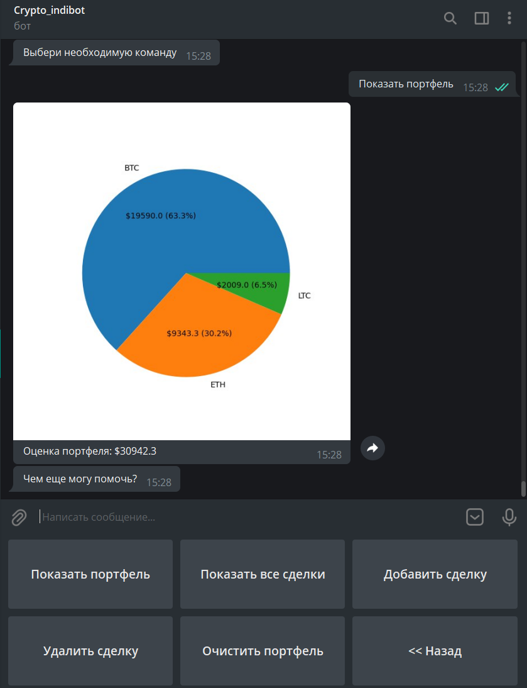

Бот в Телеграме [@Crypto_indibot](https://t.me/Crypto_indibot)

# Функционал бота

## Общее описание

* Crypto_indibot работает с биржей Yobit.net, возвращает биржевую информацию о курсе запрашиваемой пары, позволяет добавлять сделки по криптовалютам, составлят ьна их основе портфель, показывать его и рассчитывать его стоимость.

* Бот работает с пользователем через личные сообщения и позволяет для каждого пользователя вести свой портфель.

* Используется API https://yobit.net/en/api/ , публичный ключ.


## Сценарий тестирования бота:

Возможный сценарии демонстрации работы:                                 
1. Открыть [@Crypto_indibot](https://t.me/Crypto_indibot), стартовать (/start). Перейти в БИРЖА, попробовать получить информацию о криптовалютах: BTC, LTC, ETH, DODGE и другие известные.                                 
2. Перейти в ДЕМО-ДАННЫЕ -> Скопировать демо-портфель.                                
3. Перейти в МОЙ ПОРТФЕЛЬ, последовательно нажать на Показать все сделки, Показать портфель. В последнем случае отобразится график состава портфеля.                                
4. Тут же попробовать добавить свою сделку через одноименную команду; посмотреть, как изменился состав портфеля.                                
5. Далее можно попробовать Удалить сделку и Очистить портфель (восстановить всегда можно через Демо-данные).



## Структура

```
main.py - файл с основным функционалом
data - данные о порфтеле (БД добавлена в gitignore), файл local.txt с наименованием кнопок и текстом ответов бота
yobit.py - API доступа к бирже
```